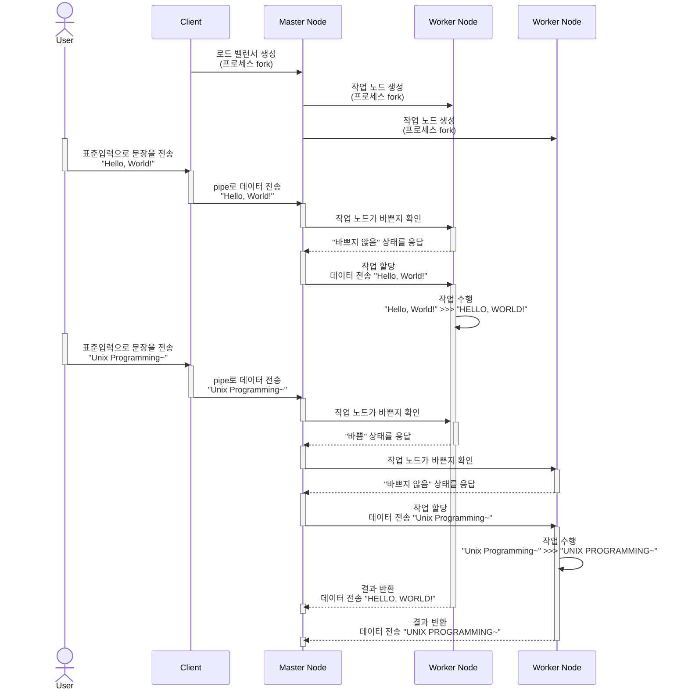

# UNIX Programming 기말 프로젝트

| 학번      | 이름   | 비고   |
| --------- | ------ | ------ |
| 202115064 | 김동주 | (조장) |
| 201810901 | 김건태 |        |

---

## 주제 설명

UNIX Programming 강의에서 배운 내용을 바탕으로, 병렬 프로세스에서 필요한 **로드밸런싱**을 간단한 형태로 구현해보는 것이 목표입니다.

### 주제 선정 동기

최신 기술 동향을 보면 클라우드 컴퓨팅과 분산 컴퓨팅 기술이 곽광받는 추세입니다.

팀장과 팀원 모두 해당 기술에 대한 탐구욕이 있었고, 팀장은 특히 분산 시스템 과목에서 이론으로만 배운 지식을 실제로 구현해보고 싶다는 욕구가 있어 본 주제를 선정하게 되었습니다.

하지만, 주어진 시간 자원의 한계에 따라 프로젝트 규모를 축소하여 특정 상황을 가정하고 진행합니다.

### 가정하는 상황

본 프로젝트에서는 "분산 환경에서 문자열 데이터를 가공해야하는 상황"을 가정합니다.

데이터를 가공한다는 것은 입력받은 문자열의 알파벳을 모두 **대문자로 변경**하는 것을 의미하며, 현실감을 더하기 위해 데이터 가공에는 **가상의 처리시간**(1초)이 소요된다고 가정합니다.

### 시스템의 유용성

분산 컴퓨팅 환경을 잘 이용하면, 규모가 큰 데이터의 처리도 효율적으로 할 수 있게 됩니다.

본 프로젝트를 통해 Unix 프로그래밍을 통해 분산 처리 환경을 조성하는 방법을 보이며, 이를 통해 데이터를 얼마나 효율적으로 처리할 수 있는지를 보일 수 있습니다.

## 시스템 설계도

프로그램의 목표는 "입력받은 문자열을 각 라인 별로 분산하여 가공한 후 출력하는 것"입니다.

이를 위하여 프로세스는 크게 3가지의 카테고리로 구분되어 각각 독립적으로 작업들을 수행합니다. 카테고리의 종류는 다음과 같습니다.

* 클라이언트(Client)
* 마스터노드(Master Node)
* 작업노드(Worker Node)

프로세스들은 서로 상호작용하지만 비동기적으로 작업을 수행할 것이며, 전체적인 구성과 흐름을 나타내면 아래의 그림과 같이 표현할 수 있습니다.


### 클라이언트(Client)

클라이언트는 표준입력으로 들어온 데이터를 마스터노드에게 전달해주는 역할을 수행합니다.

마스터노드가 로드밸런싱 작업에 집중할 수 있도록 해주는 버퍼로서의 기능을 담당하며, 데이터는 클라이언트와 마스터노드가 사전에 연결을 맺은 파이프를 통하여 단방향으로 전송이 이루어집니다.

### 마스터노드(Master Node)

마스터노드는 클라이언트로부터 전달받은 데이터를 라인 별로 쪼개어 실행중인 작업 노드들에게 분산시키는 로드밸런서입니다.

마스터노드는 로드밸런서로서의 기능을 수행하기 위해 작업노드의 상태를 관리합니다. 작업노드에게 데이터 가공을 의뢰한 순간, 해당 작업노드를 '바쁨' 상태로 기록하고, 가공 완료된 데이터를 받으면 비로소 '바쁨'상태를 해제하는 방식으로 작업노드들의 상태를 관리하며, 작업노드 큐를 생성하여 바쁘지 않은 노드들에게 순서대로 데이터 가공을 명령하는 방식으로 로드밸런싱이 진행됩니다.

### 작업노드(Worker Node)

작업노드는 마스터노드에게서 전달받은 데이터를 가공하고 반환하는 역할을 수행합니다.

본 프로젝트에서 가정하는 데이터 가공은 단순한 '대문자로 변환' 작업이며, 현실성을 더하기 위해, 작업 완료 후 `sleep()` 호출을 통해 지연 시간을 갖습니다.

작업이 완료되면 마스터노드로 작업된 데이터를 전송하며, 전송 후에는 다시 새로운 작업 요청을 기다립니다.

### 디렉터리 구조

```
.
├── _config.yml
├── _data
│   └── members.yml
├── _drafts
│   ├── begin-with-the-crazy-ideas.md
│   └── on-simplicity-in-technology.md
├── _includes
│   ├── footer.html
│   └── header.html
├── _layouts
│   ├── default.html
│   └── post.html
├── _posts
│   ├── 2007-10-29-why-every-programmer-should-play-nethack.md
│   └── 2009-04-26-barcamp-boston-4-roundup.md
├── _sass
│   ├── _base.scss
│   └── _layout.scss
├── _site
├── .jekyll-cache
│   └── Jekyll
│       └── Cache
│           └── [...]
├── .jekyll-metadata
└── indeㅌ
```

## 사용된 기술

### 프로세스 분기

### 프로세스간 통신

#### PIPE 파일

#### 소켓 프로토콜

### Make와 Modular Programming

### 배시 셸 프로그래밍

컴파일 과정과 프로세스 실행 과정을 간소화 하기 위해 셸 스크립트인 `run.sh`이 만들어져 있습니다.

스크립트는 다음과 같은 내용으로 이루어져 있으며, Unix Programming 에서 배운 내용들이 골고루 적용되어 있습니다.

* 매직 넘버 사용
* 명령행 인자 처리
* 셸 변수
* 제어문 사용
* 입출력 방향 변경

```shell
#!/usr/bin/bash

# 1. 디버그 모드로 수행
trap 'echo "$LINENO' DEBUG

# 2. 컴파일 작업 수행
make clean
clear
make

# 3. 프로그램 실행
#   명령행에 주어진 1번째 포지션 인자가 있다면,
#   해당 인자가 가리키는 파일을 표준입력으로 리디렉션.
if [[ $1 && -f $1 ]]
then
    echo "Client will read data from $1."
    bin/client < $1 & # 백그라운드에서 실행
else
    echo "Client will read data from stdin."
    bin/client
fi
```

### 로드밸런스

프로젝트의 핵심인 로드밸런스 알고리즘은 크게 다음과 같은 시퀀스로 진행됩니다.

프로세스 분기를 통해 생성된 마스터노드-작업노드 간에



## 사용 매뉴얼

### 자동으로 빌드 및 실행

```shell
# 표준 입력에서 데이터를 입력 받는 경우
./run.sh

# 파일에서 데이터를 입력 받는 경우
./run.sh <filename>
```

### 수동으로 빌드 및 실행

```shell
# 빌드
make clean && make

# 클라이언트 실행
# (마스터노드로 자동 분기)
bin/client # 표준입력으로 들어온 데이터를 작업노드로 분산

# 작업 노드 생성
# (클라이언트 프로세스를 종료하지 않은 상태로 수행)
bin/server # 마스터노드(클라이언트)로 부터 받은 데이터 가공
```

## 사용 예시 화면
